# Outline
<!--  {data-background="url('/img/tmp.png')"} -->


- [General Presentation of GraphStream](index.html)
- [First Tutorials](tutorials.html)
- Community Structures Tutorial (this presentation)


#Community structure
We will try to detect community structure in networks.

**Intuitively**, communities are groups of nodes in a network, where:

- There are more links between nodes from the same community,
- Fewer links between nodes from different communities.

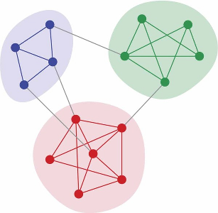


#Community structure
Lots of complex networks exhibit community structure.

- Social networks,
- Biological networks,
- Information networks,
- Road networks,
- ...

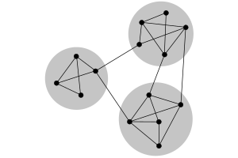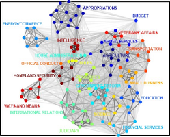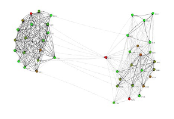

**Let's present a method to detect structures and handle network dynamics.**


#Agenda
###In this tutorial we will:

- Try to detect communities inside a network using various tools provided by GraphStream.
- See how to measure the quality of the community structure.
- See a technique to approximate communities detection, and adapt to the network dynamics.

This is not not an academic, but more a way to show you how to combine the various building blocks of GraphStream to experiment on dynamic networks.


#Determining community structure

Most often we use two kinds of criteria:

- **Internal validity**: some sort of measure indicates the importance of links inside communities compared to links between communities.
- **External validity**: we rely on an expert, having a knowledge on the network semantics, to validate the communities.

We are focused here in the first one.

#Determining communities

Once we have such a measure, several techniques can be used to find the communities:

- **Optimizing the minimum cut**: often used for load balancing. The number of communities is known in advance. One search to minimize the number of edges between communities (the cut).
- **Hierarchical clustering**: uses a similarity measure to group node pairs, in communities, then to group communities.
- **Girvan-Newman algorithm**: in this algorithm, we remove progressively edges that lie between communities, using some kind of measure to identify them.
- **Modularity maximization**: The modularity is one of the most used measures. This methods employ various techniques (often metaheuristics) to compute network divisions and maximize modularity.

#Modularity
One of the most used measure is the modularity $Q$.

Intuition:  $Q$ measures the fraction of intra-communities edges minus the same fraction if the network had edges at random (with the same communities divisions). [M. E. J. Newman (2006)](http://www.pnas.org/content/103/23/8577.full)

- If $Q=0$ the edges intra-communities is not better than random.
- If  $Q=1$ we have very strong community structure.
- In practice modular network lie between $Q=0.3$ and $Q=0.7$.

Modularity gives results in $\left[-\frac{1}{2} .. 1\right]$.

#Modularity
Suppose a given network with modules:


How to determine its modularity ?

#Modularity

<p>We could compare the proportion of internal links <span
style="color:red;">\\(I_c\\)</span> in each community \\(c\\) to the number
of edges \\(m\\). Links in green <span
style="color:green;">\\(O_c\\)</span> go out of the community \\(c\\). </p>

  $Q = \sum_c\frac{I_c}{m}~~~~~~~$ 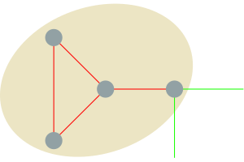

This would not be sufficient, since putting all nodes in the same community would produce a perfectly modular network !

#Modularity

Instead we compare the ratio \\(\\frac{I_c}{m}\\) with the expected value in the same network but with all its links randomly rewired, that is:

$$\frac{(2 I_c + O_c)^2}{(2m)^2}~~~~~~~~$$ 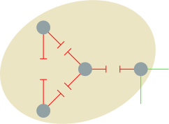


$Q = \sum_c\frac{I_c}{m} - \sum_c\frac{(2 I_c + O_c)^2}{(2m)^2}$

#Network dynamics?

- Computing the **modularity** can take some time
- But computing the **communities** themselves is the most demanding task.

If the network under analysis evolves, it becomes impossible to recompute in _real-time_ the whole modules each time a change occurs in the graph.

#Graph layouts

A novel approach to determine modules uses graph layouts.

- A layout is a mapping of nodes in a space,
- positions are given according to a (aesthetic) criteria.

Most layout algorithms are **force based**:

- repulsive force among all nodes,
- attractive force between connected nodes.

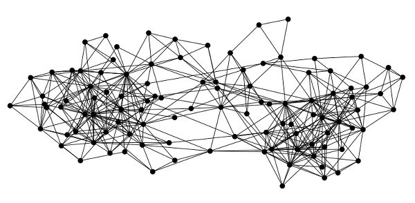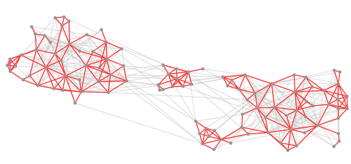


#The Lin-Log layout

- No aesthetic Layout
- Densely connected nodes are grouped at nearby positions.
- Weakly connected nodes are separated at distant positions.

Most force based algorithms try to the minimize energy.

Lin-Log is based on a $(a,r)$-energy model.

- $a$ is the attraction force factor,
- $r$ the repulsion force factor.


#The Lin-Log layout and network dynamics

After a change in the network the algorithm  computes the layout from its **previous equilibrium state**.

Chances are that reusing previous state costs less than a complete re-computation  (c.f. re-optimization).

The **Lin-Log** layout was proposed by [Andreas Noack (2007)](http://emis.u-strasbg.fr/journals/JGAA/accepted/2007/Noack2007.11.2.pdf).


#Practical session

We will see how to:

1. Read, layout and display a graph automatically.
2. Control the layout directly and change it to a Lin-Log layout.
3. Retrieve feedback from the distant view process.
4. Compute communities from the Lin-Log layout and display them.
5. Retrieve the communities.
6. Compute the modularity of these communities.
7. Stress the method on a highly dynamic network.


#How GraphStream handles display

GraphStream puts the display of the graph in a separate **thread** or **process** or **host**.

Usually the display will evolve in **parallel** of the main application  running on the graph.

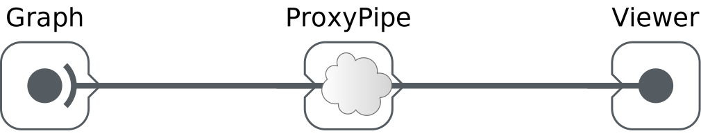


#How GraphStream handles graph layouts

By default the viewer creates another thread to handle the layout.
The default Layout algorithm is a derivative of the Frutcherman-Reingold one.

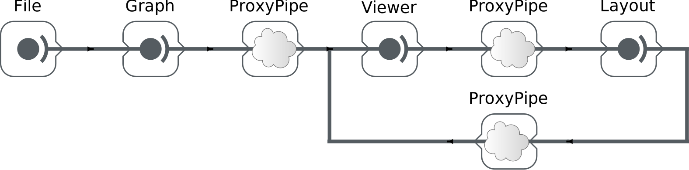

# Our Pipeline

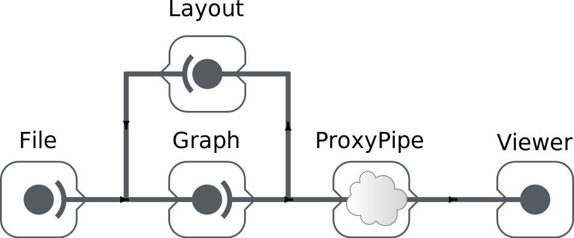


# Step 1
Open the `modularity` package (`src/org/graphstream/demo/modularity`), then the `LinLogLayout.java` file.

```java
public class LinLogLayout {
  // ...
  private Graph graph;
  private Viewer viewer;

  public void findCommunities(String fileName)
      throws IOException, GraphParseException {
    graph = new SingleGraph("communities");
    viewer = graph.display(true);
    graph.read(fileName);
  }
}
```

It creates a graph, displays, launches an automatic layout on it (the `display(true)` argument) and then reads it.


#Before proceeding

Before proceeding, to avoid compilation problems copy and paste the following imports to your program, just under the already present imports:

```java
import org.graphstream.algorithm.ConnectedComponents;
import org.graphstream.algorithm.measure.Modularity;
import org.graphstream.graph.Edge;
import org.graphstream.stream.ProxyPipe;
import org.graphstream.ui.graphicGraph.GraphPosLengthUtils;
import org.graphstream.ui.graphicGraph.stylesheet.StyleConstants.Units;
import org.graphstream.ui.layout.springbox.implementations.LinLog;
import org.graphstream.ui.spriteManager.Sprite;
import org.graphstream.ui.spriteManager.SpriteManager;
```


#Step 2

1. Stop the automatic layout.
2. Create our own LinLog layout.
3. Configure it using some $a$ and $r$ parameters.
4. Connect the layout graph events output to the graph so that the graph nodes receive position attributes.
5. Connect the graph to the layout so that the layout receive each modification event on the graph.
6. Run the layout in a loop.

----

##Step 2
```java
private LinLog layout;                  // 2
private double a = 0;                   // 3
private double r = -1.3;                // 3
private double force = 3;               // 3
public void findCommunities(String fileName) throws ... {
  graph = new SingleGraph("communities");
  viewer = graph.display(false);        // 1
  layout = new LinLog(false);           // 2
  layout.configure(a, r, true, force);  // 3
  layout.addSink(graph);                // 4
  graph.addSink(layout);                // 5
  graph.read(fileName);

  while(true) {                         // 6
    layout.compute();                   // 6
  }                                     // 6
}
```

Let's run it and observe the difference with the former layout.


#Step 3

Problem: The viewer runs in its own thread any interaction with it is not reflected on the graph. Try to grab a node with the mouse and move it... See?

Let's fix this:

1.  Create a back link from the viewer the main process.
2.  Connect this link to our graph in order to receive events.
3.  Proactively check for new events from the viewer.
4.  Check if the user closed the viewer window to properly end the program.

----

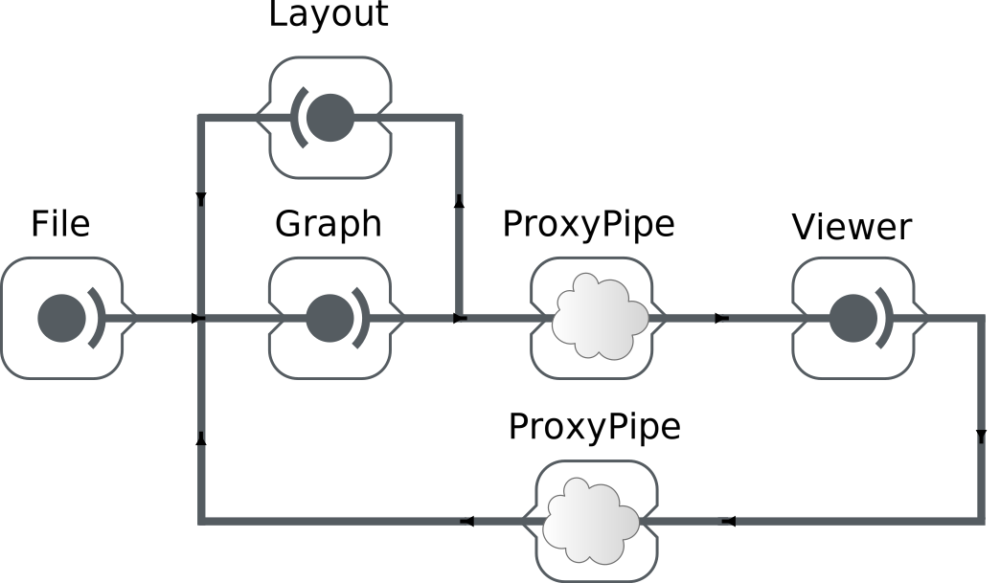


----

##Step 3
```java
private ProxyPipe fromViewer;                          // 1
public void findCommunities(String fileName) throws ... {
  graph = new SingleGraph("communities");
  viewer = graph.display(false);
  fromViewer = viewer.newThreadProxyOnGraphicGraph();  // 1
  layout = new LinLog(false);

  layout.configure(a, r, true, force);
  layout.addSink(graph);
  graph.addSink(layout);
  fromViewer.addSink(graph);                           // 2

  graph.read(fileName);

  while(! graph.hasAttribute("ui.viewClosed")) {       // 4
    fromViewer.pump();                                 // 3
    layout.compute();
  }
}

```

Now try to grab a node in the display.

----

##Finding community structure with a Lin-Log layout
**Lin-Log** creates long edges outside communities and short edges between nodes in the same communities.

Let's use this property to obtain a quick (and hopefully good enough) approximation of the communities.

- Cut edges that are longer than the global average edge length.
- The cut can then be optimised  above or under this average to improve the communities.


#Step 4

1. Add a stylesheet on the graph.
2. Enhance the display with anti-aliasing.
3. Prepare for detection of communities using the layout.
4. Specify a cut threshold (a factor for the average edge length).


#Step 4
```java
private double cutThreshold = 1;                    // 4
public void findCommunities(String fileName) throws ... {
  // ...
  graph.addAttribute("ui.stylesheet", styleSheet);  // 1
  graph.addAttribute("ui.antialias");               // 2
  graph.read(fileName);
  while(! graph.hasAttribute("ui.viewClosed")) {
    fromViewer.pump();
    layout.compute();
    showCommunities();                               // 3
  }
}

public void showCommunities() {                      // 3
  // ...
}

protected static String styleSheet =                // 1
    "node { size: 7px; fill-color: rgb(150,150,150); }" +
    "edge { fill-color: rgb(255,50,50); size: 2px; }" +
    "edge.cut { fill-color: rgba(200,200,200,128); }";

```


#Step 4 a
From the stylesheet:

- Edges are **red**.
- Edges with  `ui.class` set to `"cut"`   are **grey**.

First part of the `showCommunities()` method :

1. Browse each edge.
2. Store each edge's length.
3. Compute the average edge length.


# Step 4 a

```java
public void showCommunities() {
  int nEdges = graph.getEdgeCount();
  double length, averageLength = 0;

  for(Edge edge : graph.getEachEdge()) {              // 1
    length  = GraphPosLengthUtils.edgeLength(edge);
    edge.setAttribute("length", length);               // 2
    averageLength += length;                          // 3
  }
  averageLength /= nEdges;                            // 3

  // ...
}
```


# Step 4 b

Second part of the `showCommunities()` method:  select which edge is inter-community.

1. Browse anew each edge.
2. Compare their length with the **average** length.
3.  
    a. If they are longer, mark them with a `"cut"` attribute.
    b. Else, remove the "cut" attribute.


# Step 4 b

```java
public void showCommunities() {
  // ...
  for(Edge edge : graph.getEachEdge()) {           // 1
    length  = edge.getNumber("length");
    if(length > averageLength * cutThreshold) {    // 2
      edge.addAttribute("ui.class", "cut");        // 3.1
      edge.addAttribute("cut");
    } else {
      edge.removeAttribute("ui.class");            // 3.2
      edge.removeAttribute("cut");
    }
  }
}
```


#The Zachary Karate Club
The graph we use as a demo comes from a well known social study in a Karate Club.

Nodes represent members and edges their friendship ties.

At a given time one of the member left the club to create its own club. Some members stayed in the old one, while others quit to join the new one.

This graph usually admits at least two communities (the two clubs), although smaller sub-communities can be observed.


#Computing the number of communities


GraphStream contains a algorithm that **compute** and **update** the number of **connected components** of a graph.

This algorithm can ignore  edges with a specific attribute (say `"cut"`).

**Sprites** in the viewer help visual the number of communities.


#Step 5 a

Compute the number of connected components

1. Add a connected component algorithm.
2. Initialize it on the graph.
3. Setup a cut attribute so that the algorithm ignore the long edges.


#Step 5 a
```java
// ...
private ConnectedComponents cc;                           // 1
public void findCommunities(String fileName) throws ... {
  graph = new SingleGraph("communities");
  viewer = graph.display(false);
  fromViewer = viewer.newThreadProxyOnGraphicGraph();
  layout = new LinLog(false);
  cc = new ConnectedComponents(graph);                    // 2

  layout.configure(a, r, true, force);
  cc.setCutAttribute("cut");                              // 3
  // ...
}
// ...
```


# Step 5 b
Display the number of connected components using a sprite:

1. Create a sprite that will indicate the connected component count.
2. Position this sprite.
3. Update it regularly with the number of components.
4. Update the style sheet to display the sprite correctly.


#Step 5 b
```java
// ...
private SpriteManager sm;                                  // 1
private Sprite ccCount;                                    // 1
public void findCommunities(String fileName) throws ... {
  // ...
  cc = new ConnectedComponents(graph);
  sm = new SpriteManager(graph);                           // 1
  ccCount = sm.addSprite("CC");                            // 1
  // ...
  cc.setCutAttribute("cut");
  ccCount.setPosition(Units.PX, 20, 20, 0);                // 2
  // ...
  while(! graph.hasAttribute("ui.viewClosed")) {
    //...
    showCommunities();
    ccCount.setAttribute("ui.label",                       // 3
      String.format("Modules %d", cc.getConnectedComponentsCount()));
  }
}
// ...
protected static String styleSheet =                       // 4
    "node { size: 7px; fill-color: rgb(150,150,150); }" +
    "edge { fill-color: rgb(255,50,50); size: 2px; }" +
    "edge.cut { fill-color: rgba(200,200,200,128); }" +
    "sprite#CC { size: 0px; text-color: rgb(150,100,100); text-size: 20; }";
```


#Computing the modularity
Now that communities are identified, we can measure the quality of the partition.

GraphStream has a  **modularity** algorithm that follows each update on the graph.

- The **modularity** algorithm needs that each node contains an attribute indicating its community.
- The **connected components** algorithm can identify each component.


# Step 6 a

1. Add the modularity algorithm.
2. Create it so that it uses the  `"module"` attribute on nodes.
3. Initialise it on the graph.
4. Have the connected components algorithm tag components/communities with a `"module"` attribute.


#Step 6 a
```java
// ...
private Modularity modularity;                            // 1
public void findCommunities(String fileName) throws ... {
  cc = new ConnectedComponents(graph);
  sm = new SpriteManager(graph);
  ccCount = sm.addSprite("CC");
  modularity = new Modularity("module");                  // 2

  modularity.init(graph);                                 // 3
  layout.configure(a, r, true, force);
  cc.setCutAttribute("cut");
  ccCount.setPosition(Units.PX, 20, 20, 0);
  cc.setCountAttribute("module");                         // 4
  // ...
}
```


#Step 6 b

Display the modularity value using a sprite:

1. Add a sprite for the modularity.
2. Position it.
3. Update it regularly with the modularity value.
4. Update the style sheet for this other sprite.


#Step 6 b

```java
// ...
private Sprite ccCount, modValue;                            // 1
public void findCommunities(String fileName) throws ... {
  // ...
  modularity = new Modularity("module");
  modValue = sm.addSprite("M");                              // 1
  // ...
  cc.setCutAttribute("cut");
  ccCount.setPosition(Units.PX, 20, 20, 0);
  cc.setCountAttribute("module");
  modValue.setPosition(Units.PX, 20, 40, 0);                 // 2
  // ...
  while(! graph.hasAttribute("ui.viewClosed")) {
    //...
    ccCount.setAttribute("ui.label",
      String.format("Modules %d", cc.getConnectedComponentsCount()));
    modValue.setAttribute("ui.label",                        // 3
      String.format("Modularity %f", modularity.getMeasure()));
  }
}

protected static String styleSheet =
    // ...                                                   // 4
    "sprite#CC { size: 0px; text-color: rgb(150,100,100); text-size: 20; }" +
    "sprite#M  { size: 0px; text-color: rgb(100,150,100); text-size: 20; }";
```


#That's it!


Some other graphs are provided in the <code>data</code> directory of
the eclipse project.

You can experiment on them, and play with the
`cutThreshold` parameter as well as the $(a, r)$ and
`force` parameters. Here is a set of good values for these
graphs:

| Graph        | a | r    | force | cutThreshold |
|--------------|---|------|-------|--------------|
| karate.gml   | 0 | -1.3 | 3     | 1            |
| dolphins.gml | 0 | -1.2 | 8     | 0.8          |
| polbooks.gml | 0 | -1.9 | 5     | 0.8          |


# What about a dynamic graph {data-background=url(/img/boids.png)}

Let's try the method on a really dynamic graph.

Consider a [Boids](http://www.red3d.com/cwr/boids/) Simulation.


The `LinLogLayoutAndBoids.java` file in the ` modularity` package contains a working example of LinLog analysis of a Boids simulation.
