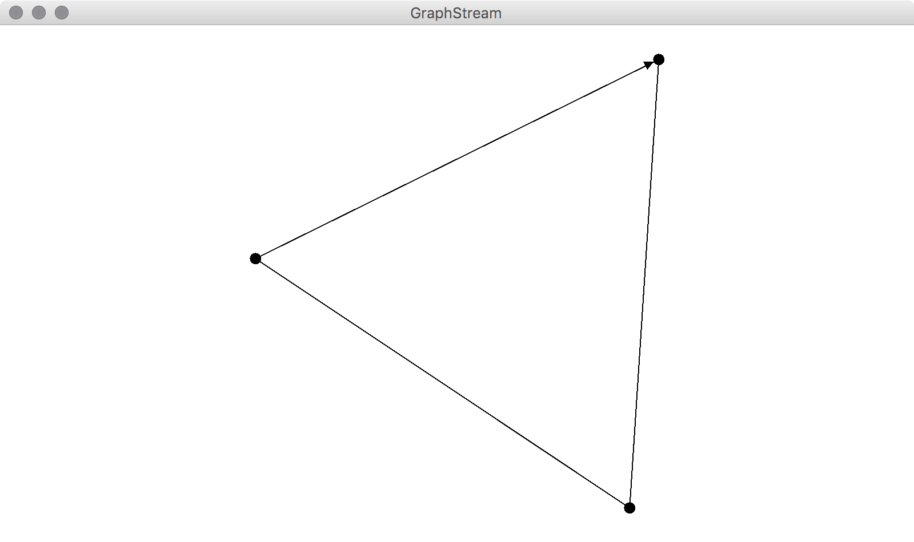
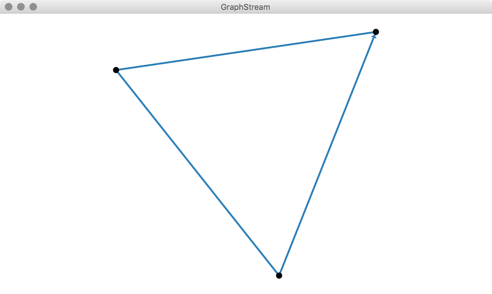
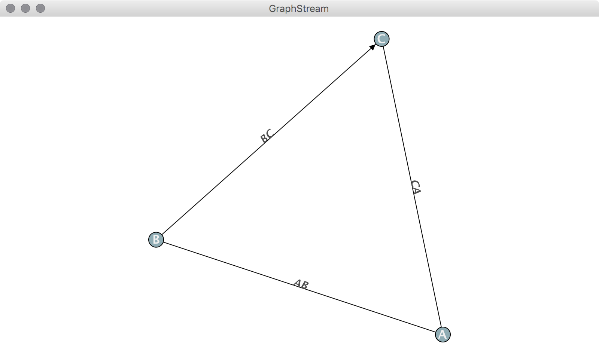
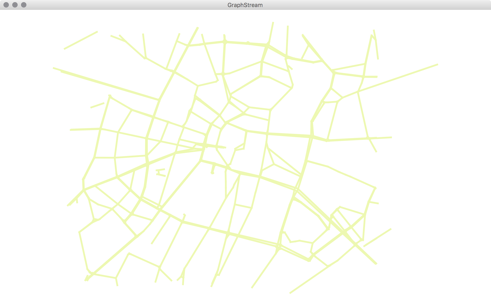
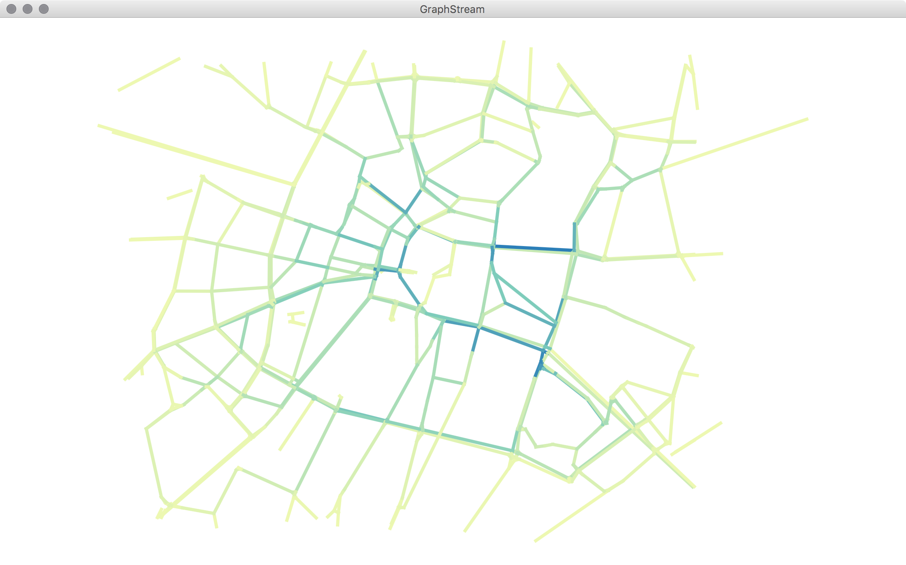

# Outline
<!--  {data-background="url('/img/tmp.png')"} -->


- [General Presentation of GraphStream](index.html)
- Demonstrations and Examples


# Installation of GraphStream

- Get GraphStream's jar files from GitHub's release page : <https://github.com/graphstream/gs-core/releases>
- Use Maven (or gradle etc.) and configure GraphStream as a dependency

```xml
<dependency>
    <groupId>com.github.graphstream</groupId>
    <artifactId>gs-core</artifactId>
    <version>2.0-alpha</version>
</dependency>
```

# Get the tutorial workspace

- Go to the tutorial page at github:
[github.com/graphstream/gs-talk](https://github.com/graphstream/gs-talk)
- Get the code:
    - with the "Download Zip" button on github (will download an archive)
    - or through git:

```sh
git clone git://github.com/graphstream/gs-talk.git

```

In that project, we want the `Demos/` folder.


# Demo 1 -- A simple static graph


### Basic tasks with GraphStream


# Create and display

```java
public class Demo1 {
	public static void main(String args[]) {
		System.setProperty("org.graphstream.ui", "swing");
		Graph graph = new SingleGraph("Demo 1");
		graph.display();
		graph.addNode("A");
		graph.addNode("B");
		graph.addEdge("AB", "A", "B");
		graph.addNode("C");
		graph.addEdge("BC", "B", "C", true); // Directed edge.
		graph.addEdge("CA", "C", "A");
	}
}
```

---




# Change the Display with CSS

We can improve the display with some CSS:

```java
...
graph.display();

graph.setAttribute("ui.quality");
graph.setAttribute("ui.antialias");
graph.setAttribute("ui.stylesheet", "" +
                   "edge {" +
                   "   size: 4px;" +
                   "   arrow-size: 5px, 5px;" +
                   "   fill-color: #2c7fb8;" +
                   "}");

```

---




# Access Elements

- Nodes and edges are identified by an unique string.
- They are accessible at creation time:
  ```java
Node n = graph.addNode("A");
  ```
- Or after creation:
  ```java
Node n = graph.getNode("A");
  ```

# Constructive API vs. Events

- Nodes and edges are removed the same way:
  ```java
  graph.removeNode("A");
  ```
- Each change, at anytime, is considered as an “event”.
- The sequence of changes is seen as the dynamics of the graph.
- There are many other ways to modify the graph.

# Attributes

Data stored in the graph, on nodes and edges, are called “attributes”.
An attribute is a pair (name,value).

```java
Edge ab = graph.getEdge("AB");
Edge bc = graph.getEdge("BC");
Edge ca = graph.getEdge("CA");

ab.setAttribute("ui.label", "AB");
bc.setAttribute("ui.label", "BC");
ca.setAttribute("ui.label", "CA");

for(String id : new String[]{"A", "B", "C"}){
    graph.getNode(id).setAttribute("ui.label", id);
}
graph.setAttribute("ui.stylesheet", "url(data/style.css);");

```

---




# Define Attributes

- Not all attributes appear in the viewer.
- Notice the way you can add arrays with `setAttribute()` and a variable number of arguments:

```java
ab.setAttribute("aNumber", 10);
bc.setAttribute("anObject", new Double(10));
ca.setAttribute("anArrayOfThings", 1, 2, 3);
```

# Retrieve Attributes

Several ways to retrieve attributes:

```java
int value1 = ((Number) ab.getAttribute("aNumber")).intValue();
double value2 = (double) bc.getAttribute("anObject");
Object[] value3 = (Object[]) ca.getAttribute("anArrayOfThings");        
```

Special methods are here to simplify access:

```java
double value4 = ab.getNumber("aNumber");
Object[] value5 = bc.getArray("anArrayOfThings");
```


# Traversing the graph

GraphStream 2.0 uses Java 8 *streams*.

Access all nodes:

```java
graph.nodes()
    	.forEach(node -> System.out.println(node.getId()));
```

Equally for edges:
```java
graph.edges()
    	.forEach(edge -> System.out.println(edge.getId()));
```


# Index-based  access

Indices for nodes:

```java
int n = graph.getNodeCount();
for(int i=0; i<n; i++) {
	System.out.println(graph.getNode(i).getId());
}

```

Indices for edges:

```java
int n = graph.getEdgeCount();
for(int i=0; i<n; i++) {
	System.out.println(graph.getEdge(i).getId());
}

```
⚠ indices remain the same as long as the graph is unchanged. ⚠


# Travers from nodes and edges

You can also travel the graph using nodes:

```java
import static org.graphstream.algorithm.Toolkit.*;
//...
Node node = randomNode(graph);

node.edges().forEach(e -> {
	System.out.printf("neighbor %s via %s%n",
		e.getOpposite(node).getId(),
		e.getId() );
})
```


- Each node and edge allow to iterate on their neighborhood.
- `Toolkit` is set of often used functions and small algorithms (see the [API](http://www.graphstream-project.org/api/gs-algo/org/graphstream/algorithm/Toolkit.html)).


# Orientation-based interaction

Directed edges stream from a given node:

```java
Node node = getRandomNode(graph);

node.leavingEdges().map(...)

node.enterigEdges().map(...)
```


Get a node's degree, entering degree  or leaving degree:

```java
System.out.printf("Node degree %d (entering %d, leaving %d)%n",
	node.getDegree(),
	node.getInDegree(),
	node.getOutDegree());

```

# Demo 2


### Dynamic Graphs

# Sinks

- A graph can receive events. It is a _sink_.
- A _sink_  is connected to a _source_ using the `Source.addSink(Sink)` method.
- Events are filtered by type (_Elements Events_ and _Attributes Events_) :
    - `addElementSink(ElementSink)`.  Nodes and edges are _Elements_.
    - `addAttributeSink(AttributeSink)`. Data attributes are stored on every element.
- A `Sink` is both an `ElementSink` and `AttributeSink`.

# ElementSink

ElementSink is an interface
```java
public interface ElementSink {
	void nodeAdded( ... );
	void nodeRemoved( ... );
	void edgeAdded( ... );
	void edgeRemoved( ... );
	void graphCleared( ... );
	void stepBegins( ... );
}
```


# AttributeSink

An attribute sink must follow the interface:

```java
public interface AttributeSink {
	void graphAttributeAdded( ... );
	void graphAttributeChanged( ... );
	void graphAttributeRemoved( ... );

	void nodeAttributeAdded( ... );
	void nodeAttributeChanged( ... );
	void nodeAttributeRemoved( ... );

	void edgeAttributeAdded( ... );
	void edgeAttributeChanged( ... );
	void edgeAttributeRemoved( ... );
}
```

# Source
A source is an interface that only defines methods to handle a set of sinks.

```java
public interface Source {
	void addSink(Sink sink);
	void removeSink(Sink sink);
	void addAttributeSink(AttributeSink sink);
	void removeAttributeSink(AttributeSink sink);
	void addElementSink(ElementSink sink);
	void removeElementSink(ElementSink sink);
	void clearElementSinks();
	void clearAttributeSinks();
	void clearSinks();
}

```

# A first dynamic graph

Since Graph is a _sink_ let's create a graph from a set of events generated by a _source_.

- A file with  information about graphs (in a proper file format) can be a source of events.
- A few graph file formats can handle dynamic.
- GraphStream provides a file format (DGS) that allows to store and load dynamic graphs.


# The GDS File Format

- `an` for "add node".
- `ae` for "add edge". `ae "AB" "A" > "B"` adds a directed edge between nodes `A` and `B`.
- `cn`, `ce` and `cg` change or add one or more attributes on a node, an edge or the graph.
- `dn` and `de` allow to remove nodes, edges.

```c
DGS003
"Demo 2" 0 0
an "A"
an "B"
an "C"
ae "AB" "A" "B"
...
```

# How to handle dynamics

- Storing temporal information is tricky.
- Timestamps on events is a  good way to encode time
- But some events occur at the same time.
- Let's define _time steps_ within events
- `st <number>`

# Steps in DGS

The ability to remove nodes and edges makes the format support dynamic.

```c
st 2
an "D" label="D"
an "E" label="E"
ae "BD" "B" "D" label="BD"
ae "CE" "C" "E" label="CE"
ae "DE" "D" "E" label="DE"
st 3
de "AB"
st 4
dn "C"
```

# Read the whole file

The file can be read entirely :

```java
graph.read("demo2.dgs");
```

- However this will send all events as fast as possible.
- We have no control over the speed at which events occur.


# Read the file event by event

We can read the DGS file event by event using an input source:

```java
Graph graph = new SingleGraph("Demo2");
graph.display();
FileSource source = new FileSourceDGS();
source.addSink( graph );
source.begin("data/demo2.dgs");
while( source.nextEvents() );
source.end();
```


# Read the file step by step
- The `nextEvents()` method reads the file event by event (line by line in the file)
- The `nextStep()`methods reads events up to the next `st` command (all the lines between two `st` lines)

```java
while(source.nextStep()) { 
	/* Do something... Compute an algorithms... Sleep...*/
 }
```

# Graph Layout

- By default spacial positions of nodes on the display are automatically computed.
- However one may want to position nodes by ourself.
- One can do this using the `x` and `y` attributes:

```c
an "A" x=0 y=0.86
an "B" x=1 y=-1
an "C" x=-1 y=-1
// ...
an "D" xy=1,-2
an "E" xy=-1,-2
```

Then one have to tell the viewer not to compute nodes positions:

```java
graph.display(false);
```

# Demo 3


### Geographic Graphs

# Working with geographic data

The `gs-geography` project brings the opportunity to read geographical data file format and produce graphs. 

For instance, one can read an OpenStreetMap  map to produce a graph of the road network, where nodes would be intersections and edges would be roads.


---



# Graph Algorithms for geographic data

---




----

<section data-background=" #efedef">

 <!-- <video controls  width="1280" height="800" >
  <source data-src="img/GraphStream 1.0.mp4" type="video/mp4">
</video> -->
<iframe width="1280" height="800" src="https://www.youtube.com/embed/XX5rRF6uxow" frameborder="0" allowfullscreen></iframe>
</section>
