# Sources

Codes and Presentations are on GitHub

- Code : [github.com/graphstream/gs-talk](https://github.com/graphstream/gs-talk)
- Slides : [graphstream.github.io/gs-talk](https://graphstream.github.io/gs-talk)

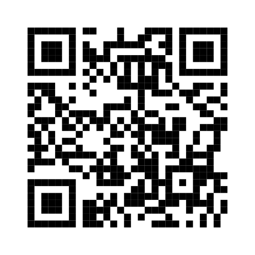


# Outline
<!--  {data-background="url('/img/tmp.png')"} -->


- General Presentation of GraphStream (this presentation)
- [First Tutorials](tutorials.html)
- [Community Structures Tutorial](communities.html)


#Outlook

- Dynamic Graphs
- GraphStream
- The Event Model
- Algorithms
- Visualisation
- Interaction with other tools


#First, static graphs
## Structure:{data-xx="ok"}

- Nodes, Vertices
- (undirected) Edges, Links
- (directed) Arcs


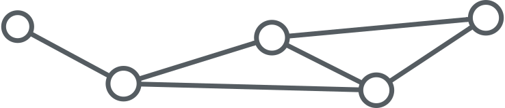


#First, static graphs
##Algorithms: Graphs Theory

- graph colouring problems
- routing problems
- flow problems
- covering problems
- subgraphs problems


# When we add dynamics...

## What kind of dynamics?

- values/weight on edges or nodes?
- nodes and/or edges added/removed?



# When we add dynamics...
## Problem with algorithms

- As soon as it gets computed, the result has vanished.
- Can we stop the graph and recompute?
- Depends on the dynamic graph model.




#Dynamic Graph Models


Many graph models consider dynamics in some ways. But they are usually bounded to their application domain.

- Is there a general-enough model that can be used in a broad range of applications?
- What about a **Dynamic Graph Theory** with algorithms for colouring, routing, flows, etc.?

# Complex Networks

1. **Exploration**: Analysis of "real world" networks (web graphs, biological networks, social networks)

2. **Modelling**: Build artificial networks (Barabasi-Albert, Watts-Strogatz, Dorogovtsev-Mendes, Golomb
, etc.)


- Measures on graphs: community, distribution, dimensions, etc.
- Iterative Construction/Iteration: we see dynamic graphs here!

# Aggregative Methods
All the evolution is known **in advance**, the dynamic graph is aggregated into a static graph. (Temporal Networks, Evolving Graphs, Time-Varying Graphs, etc.)

Why? Because it allows the use of classical graph theory.


#Re-optimisation

Build and maintain structures on dynamic graphs (e.g. spanning trees) **without** prior knowledge of the evolution.

**Hypothesis**: Updating an existing structure after some modifications is more effective that recomputing it from scratch.



#GraphStream


**Study interaction networks and their dynamics**


- Dynamic Algorithms
- Dynamic Visualisation

A free and open-Source project supported by the University of Le Havre.

- Stefan Balev
- Antoine Dutot
- Yoann Pigné
- Guilhelm Savin


#In a nutshell

A Java library with a handy public API
```java
Graph g = new SingleGraph("MyGraph");
g.read("some-file.tlp");
g.getDegree();
g.display();
```

Based on an event model: Nodes and Edges are Added/Removed/Modified

Interaction with over tools

- Offline: several import / export file formats
- Online: through the API or through a network connection


#Architecture
###Public API <small>[graphstream-project.org/doc/API](http://graphstream-project.org/doc/API)</small>
- `org.graphstream`
    - `.graph`
    - `.stream`
    - `.ui`
    - `.algorithm`


###Organised into sub-projects <small>[github.com/graphstream](https://github.com/graphstream)</small>
- `gs-core`, `gs-algo`, `gs-ui`,
-  `gs-netstream`, `gs-boids`, `gs-netlogo`, `gs-geography`, ...


# Get GraphStream!
### On the Website
- [graphstream-project.org](http://graphstream-project.org)
- official releases (v1.3) of gs-core, gs-algo, gs-ui
- nightly-builds

### On Github
- [github.com/graphstream](https://github.com/graphstream)
- bug tracker on the `gs-core` project

### On Maven
```xml
<groupId>org.graphstream</groupId>
<artifactId>gs-core</artifactId>
<version>1.3</version>
```


#GraphStream's Event Model
The dynamics of the graph is expressed by an **event model**

Events

- Addition or removal of nodes
- Addition or removal of edge
- Addition, update or removal of data attributes
- Time steps


A **stream of events** modifies the structure of a graph.

#GraphStream's Event Model

###Sources

Produce streams of events.
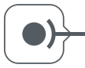


###Sinks
Receive streams of events.
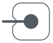


###Pipes
Both source and sink. A **graph** is a pipe.
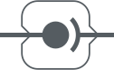


# Pipelining
Sources send events to sinks.

- Observer design pattern
- Publish / Subscribe
- Java Swing listeners

Sources, pipes and sinks can be connected to form pipelines.


#Pipelining

```java
Graph graph = new SingleGraph("Some Graph");
graph.display();
FileSource source = new FileSourceDGS();
source.addSink( graph );
source.begin("someFile.dgs");
while( source.nextEvents() ){
  // Do whatever between two events
}
source.end();
```


#Pipelining

The stream of events can flow between sources and sinks:

- across the network,
- processes,
- threads.

For example a viewer can run in a distinct thread or machine, while a simulation on a graph runs on another.

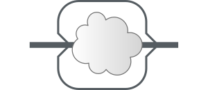


#Pipelining

Receive events from another some other process/thread/programme/machine

```java
Graph g = new SingleGraph("RWP");
ThreadProxyPipe pipe = getPipeFromElsewhere(); //fake function
pipe.addSink(g);
g.display(false);

while (true) {
  pipe.pump();
  Thread.sleep(1);
}
```


#Graph components

###Various graph structures

- "Single" graphs (1-graph),
- "multigraphs" (p-graphs, that are graphs where several edges can connect two nodes).
- Directed and/or undirected graphs.

###Several internal representations

- fast data retrieval,
- data compactness.


Representation of a graph at a given time (static). But this representation can evolve.

# Data Attributes

- Any number of data attributes can be associated with any element of the graph.
- An attribute is made of a **key** and a **value** that can be any Java Object.
- You can place attributes on nodes, edges and on the graph itself.


```java
g.addAttribute("My attribute", aValue);
Node n = g.getNode("A");
n.setAttribute("xy", 23.4, 55.0);
Edge e = g.getEdge("AB");
e.removeAttribute("selected");
double w = e.getNumber("weight");
```

#Algorithms
###Searches
random searches, shortest paths, spanning trees, etc.

###Metrics
modularity, centrality, degree distributions, connectivity, density, etc.

###Generators
random, regular, preferential attachment, small world, from GIS, from the web, etc.


#Focus on Dynamic Connected Components

```java
import org.graphstream.algorithm.ConnectedComponents;
//...
ConnectedComponents cc = new ConnectedComponents();
cc.init(graph);
while(something) {
  cc.getConnectedComponentsCount();
  canDoSomethingWithGraph();
}
```

#Focus on Dynamic Shortest Paths

```java
import org.graphstream.algorithm
          .networksimplex.DynamicOneToAllShortestPath;
//...
DynamicOneToAllShortestPath algorithm =
                new DynamicOneToAllShortestPath(null);
algorithm.init(graph);
algorithm.setSource("0");
while(something) {
  algorithm.compute();
  canDoSomethingWithGraph();
}
```


#Algorithms
Some tutorials to go farther

[graphstream-project.org/doc/Algorithms/](http://graphstream-project.org/doc/Algorithms/)


#Visualization

1. Dynamic Visualization: the graph is evolving, so does the visualization.
2. Get more information than the graph itself: sprites.

   <!--video controls  >
  <source src="img/boids.mp4" type="video/mp4">
</video-->  <iframe width="560" height="315" src="https://www.youtube.com/embed/hv8vrvzG9y0" frameborder="0" allowfullscreen></iframe>


# Extra visual information

##CSS

```css
graph { padding: 50px; }
node {
  size-mode: fit; shape: rounded-box;
  fill-color: white; stroke-mode: plain;
  padding: 5px, 4px; icon-mode: at-left;
  icon: url('data/Smiley_032.png');
}    

```

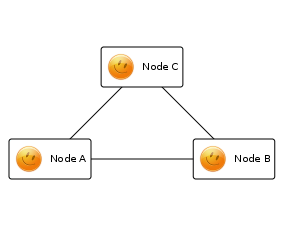


#Extra visual information
##CSS classes
```java
graph.addAttribute("stylesheet",
  "graph {padding : 50px;}"
  + "node {size: 100px; fill-mode: image-scaled;}"
  + "node.fun {fill-image: url('fun.gif');}"
  + "node.dull {fill-image: url('dull.png');}");

Node a = graph.addNode("A");
Node b = graph.addNode("B");
Node c = graph.addNode("C");
graph.addEdge("AB", "A", "B");
graph.addEdge("CB", "C", "B");
graph.addEdge("AC", "A", "C");
a.addAttribute("ui.class", "fun");
b.addAttribute("ui.class", "fun");
c.addAttribute("ui.class", "dull");

```

#Extra visual information
##CSS classes


#Extra visual information
##Sprites

Graphical objects that give extra information on the application you deal with.

```java
SpriteManager sman = new SpriteManager(graph);
Sprite pin = sman.addSprite("pin");
```

Sprites are also customised with CSS 

```css
sprite#pin {
    shape: box;
    size: 32px, 52px;
    fill-mode: image-scaled;
    fill-image: url('mapPinSmall.png');
}
```

----
<section data-background=" white">

</section>

----

<section data-background=" white">

</section>


# Interactions with other Tools


# Offline interactions

### File formats

Tulip, Gephi, GML, Pajek, DOT, LGL, ncol, DGS

```C
DGS004
"graph.dgs" 0 0
an A x:1 y:2.3 label:"Node A"
an B x:0 y:0
an C xy:2.3,1
an D xyz:1,1
ae AB A B weight:23.3
ae AC A C weight:2
st 1.0
ae BC B > C
ae BD B > D
st 1.1
dn B
```

# OnLine interactions

### NetStream

- Export streams of events to other applications / machines / languages
- Both ways. From GS to other and from other to GS
- Binary network protocol
- TCP socket (and WebSocket) implementation
- Several languages (Java, C++, Python, JS)

```java
import org.graphstream.stream.netstream.NetStreamReceiver;
//...
NetStreamReceiver net = new NetStreamReceiver(2001);
ThreadProxyPipe pipe = net.getDefaultStream();
pipe.addSink(graph);
while (true) {
  pipe.blockingPump();
}
```

# NetLogo Extension

- NetLogo agents (turtles, links and observer) send graph events to external application
- The external application maintains a dynamic graph and runs algorithms on it
- It sends the computed results back to NetLogo
- Agents can receive and use them to take their decisions


----

<section data-background=" #efedef">

<!-- <video controls  width="1280" height="800">
  <source src="img/graphstream-1.0.mp4" type="video/mp4">
</video> -->
<iframe width="1280" height="800" src="https://www.youtube.com/embed/XX5rRF6uxow" frameborder="0" allowfullscreen></iframe>
</section>


<!-- END -->
